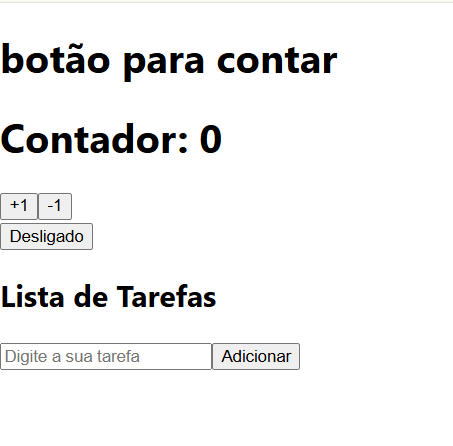

## Introdução aos Hooks e useState no React

**objetivo**: Criando um codigo usando useState

Contador.js:
- useState cria a variavel chamada 'contador' e a função 'setContador' que atualiza seu valor
- tem dois botões que usam 'setContador' para atualizar seu valor em almentar seu valor em 1 e outro para diminuir em 1
- codigo que cria o botão 

Botaoalternado.js:
- useState('desligado') cria uma variavel chamada 'estado' quem tem valor "desligado" e a função setEstado atualiza ele
- quando clicamos no botão o valor é mudado para "ligado" ou "desligado"

Listatarefas.js:
- useState('') cria a variavel tarefa que armaneza a tarefa atual
- useState([]) cria a variavel tarefas que armazena a lista

