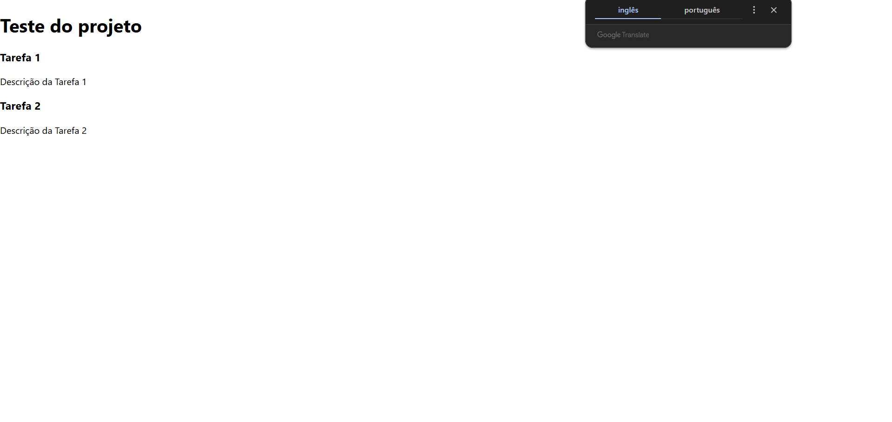

## React elements JSX

**objetivo**: Criando Elementos Container e Componentes Pai

Passo a passo

passo 1: criando workspace, os seguintes comandos irão criar, preparar e executar respectivamente o projeto
- npx create-react-app task-manager
- cd task-manager
- npm start

Passo 2: No arquivo src/App.js, remover o conteúdo e criar um layout com dois containers:

- import React from 'react': o React é importado para que o JSX possa ser usado
- import Header from './components/Header' e import TaskContainer from './components/TaskContainer' importam dois componentes chamados Header e TaskContainer de arquivos localizados nas pastas components.
- função App define o componente principal da aplicação.
- no div são renderizados os componentes Header e TaskContainer.
- export default App; exporta o componente App

Passo 3: Header.js

- import React from 'react'; importa a biblioteca React para o arquivo.
- Header define a estrutura do que será exibido na tela.
- export default Header; permite que o componente Header seja exportado

passo 4: TaksContainer.js

- import React from 'react'; importa a biblioteca React para o arquivo.
- import Task from './Task'; importa o componente Task de outro arquivo no diretório ./Task.
- TaskContainer é uma função que retorna o JSX.
- tasks que é um array de objetos
- div envolve os componentes Task gerados pelo map() 
- export default TaskContainer; exporta o componente TaskContainer

passo 5: Task.js

- import React from 'react'; importa a biblioteca React para o arquivo.
- import PropTypes from "prop-types"; PropTypes é importada 
- Task é um componente funcional que recebe title e description como props
- { title, description } puxa as funções em questão

